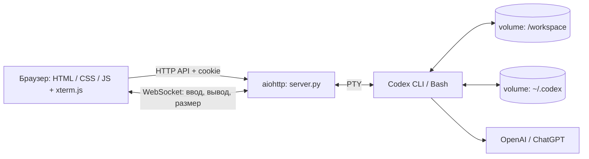

# Техническое устройство

## Назначение и границы

Codex Workspace предоставляет владельцу сервера доступ к настоящему интерактивному Codex CLI через браузер. Это приложение для одного владельца: пароль общий, сессии видны всем его вкладкам. Пользовательских аккаунтов, ролей, отдельного хранилища чатов и редактора файлов нет. Команды и подтверждения обрабатывает стандартный CLI.

## Компоненты

| Компонент | Файл / место | Ответственность |
| --- | --- | --- |
| Сервер | `server.py` | Вход, сессии, PTY, HTTP и WebSocket |
| Клиент | `static/app.js` | Список сессий, терминал, переподключение |
| Представление | `static/index.html`, `static/style.css` | Русский интерфейс, адаптация для телефона |
| Сборка ресурсов | `download-assets.py` | Загрузка Codex и xterm.js из npm, проверка checksum, потоковая распаковка |
| Образ | `Dockerfile` | Python, CLI, Git, Node.js и npm; uid/gid 1000 |
| Развёртывание | `scripts/manage.py`, shell-обёртки | Конфигурация, сборка, ручной start/stop, обновление и перенос |

В браузере используются локальные ресурсы: CDN для JavaScript и CSS не нужен. Сеть необходима при сборке зависимостей и работе Codex с провайдером модели.

## Сессии и терминал

Сервер запускает дочерний процесс через `pty.fork()`, подключает master descriptor к asyncio и передаёт данные через WebSocket. Ввод поступает в PTY без запуска дополнительной командной оболочки сервера. Bash-сессия запускается явно как самостоятельный инструмент.

| Тип | Запуск |
| --- | --- |
| `codex` | `codex --no-alt-screen --no-daemon -s workspace-write -a on-request` |
| `resume` | Те же параметры и подкоманда `resume` |
| `shell` | `/bin/bash --noprofile --norc -i` |
| `login` | `codex login --device-auth` |

Одновременно допускаются две незавершённые сессии. Рабочая папка должна существовать и после разрешения symlink находиться внутри `/workspace`. Размер PTY ограничен 20–400 колонками и 5–150 строками.

Для переподключения сервер хранит последние 1 048 576 **символов** вывода каждой сессии. При подключении этот буфер воспроизводится перед новыми событиями. В браузере задан scrollback 10 000 строк. Очередь каждого клиента ограничена 128 событиями; медленный клиент отключается и может подключиться снова.

Закрытие вкладки не останавливает процесс. Явное завершение сессии посылает process group `SIGHUP`, затем через три секунды при необходимости `SIGKILL`. Статус завершения проверяется через `waitpid` каждые 200 мс.

## Состояние и перезапуск

| Данные | Хранение | После перезапуска контейнера |
| --- | --- | --- |
| Проекты | volume `codex-web-workspace` | Сохраняются |
| Авторизация, настройки и история CLI | volume `codex-web-home` | Сохраняются |
| Активные процессы, список web-сессий, буфер PTY | Память сервера | Теряются |
| Токены входа в web-интерфейс | Память сервера | Требуется повторный вход |
| Последняя выбранная web-сессия | `localStorage` браузера | ID сохраняется, но при отсутствии сессии открывается обзор |

Продолжить разговор после перезапуска можно через новую сессию типа `resume`. Приложение не сохраняет и не восстанавливает незавершённые shell-процессы.

Restart policy контейнера — `no`. ОС и Docker daemon не запускают приложение автоматически после reboot; владелец запускает его через `scripts/start.sh` и останавливает через `scripts/stop.sh`. Политика задаётся и Docker CLI, и Compose; при использовании скриптов на старой установке она приводится к ручному режиму.

## Авторизация и изоляция

Вход в web-интерфейс и вход в Codex — разные механизмы. `WEB_PASSWORD` проверяется сервером через `hmac.compare_digest`. После входа выдаётся случайная cookie `codex_web`: HttpOnly, SameSite=Strict, срок 12 часов. На IP допускается десять попыток входа за пять минут. Для изменяющих запросов и WebSocket требуется Origin с тем же host/port.

Cookie получает Secure только когда aiohttp видит HTTPS; штатный сервер слушает HTTP. При TLS-прокси флаг Secure нужно выставить на прокси. Приложение не интерпретирует `X-Forwarded-Proto` как доверенный источник. Для простого защищённого доступа предусмотрен вариант с SSH-туннелем.

Контейнер не имеет Docker socket, host bind mounts и дополнительных capabilities; используется `no-new-privileges`. CLI работает как пользователь `codex` с uid/gid 1000. `WEB_PASSWORD` удаляется из окружения PTY-процессов. Это приложение для доверенного владельца: доступ к Bash позволяет менять доступные этому пользователю файлы, включая настройки CLI внутри контейнера.

CLI использует `workspace-write` и `on-request`. Работа его внутреннего sandbox зависит от ядра, user namespaces и seccomp хоста; запросы подтверждения показываются в терминале. Параметры обхода подтверждений приложение не включает.

## Ресурсы и версии

- Python 3.12, aiohttp 3.14.3; все Python-пакеты зафиксированы в `requirements.lock`.
- Codex CLI 0.160.0 по умолчанию, xterm.js 6.0.0, addon-fit 0.11.0.
- Сборка: 256 МБ RAM, без дополнительного swap, квота 0.5 CPU.
- Приложение: 384 МБ RAM, без дополнительного swap, квота 0.75 CPU, 128 процессов.
- Healthcheck: `/healthz` каждые 30 секунд; проверяет HTTP-сервер, а не доступность модели.
- Логи: не более трёх файлов по 10 МБ. Вывод терминала не дублируется в Docker access log.

Нагрузка команд внутри терминала входит в лимиты контейнера. Смена настроек CLI возможна в `/home/codex/.codex/config.toml`; имя модели в код приложения не зашито. Наличие `auth.json` не гарантирует доступ к любой выбранной модели.
